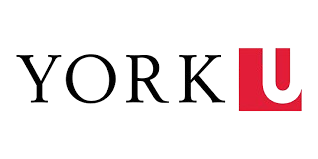

  

This repository is a curated collection of projects intended to showcase my abilities as both a physicist and a computer scientist. As a double major in the two, I wanted to highlight the interdisciplinary nature of my degree and show how I use code to explore scientific and technical problems.

I decided to include three projects, each showing a different part of my background and interests: quantum computing, computational physics, and agentic AI. Together, they are meant to paint a picture of both my current ability and my trajectory as an aspiring detector physics and quantum researcher.

The repository contains three main projects:

1. [Quantum vs Classical Measurement, a Qiskit Investigation](https://github.com/brymh/RAYPortfolio2026/blob/main/fourier_quantum_measurement.ipynb)  
   This notebook focuses on quantum measurement and was actually the first context in which I interfaced with a real quantum computer. It features Matplotlib, Qiskit, NumPy, and SciPy as I document my experience independently studying quantum information and working toward the IBM Qiskit Developer Certification.

2. [Agentic AI for Optimized Graph Traversal of Delivery Vehicles Utilizing Gemini](https://github.com/brymh/RAYPortfolio2026/blob/main/agentic_gemini_graph_pipeline.ipynb)  
   This notebook displays my formal training in computer science. It uses agentic AI rules written by me, interfaces with Google's Gemini API, and applies graph traversal and simplification techniques to a delivery-routing style problem. I also mapped out regions of NYC with Matplotlib which was pretty cool, not what you would expect from a statistical analysis tool!

3. [Applying Bayesian Inference Techniques on M31 Andromeda Data](https://github.com/brymh/RAYPortfolio2026/blob/main/mcmc_andromeda_core_cusp.ipynb)  
   This notebook highlights my ability to approach physics problems computationally. Using MCMC sampling through the Metropolis algorithm, I fit a dark matter enclosed mass model to the rotation curve of the Andromeda Galaxy with data from Corbelli et al. (2010).

Together, these projects represent the intersection of my interests in physics, computation, and research-oriented thinking. They are not meant to be final, perfect research papers, but rather examples of how I learn, build, test ideas, and apply technical tools across different areas of science and computing.

If you have any questions, or if you would like me to walk you through any of the projects, feel free to reach out at [brymh@my.yorku.ca](mailto:brymh@my.yorku.ca).